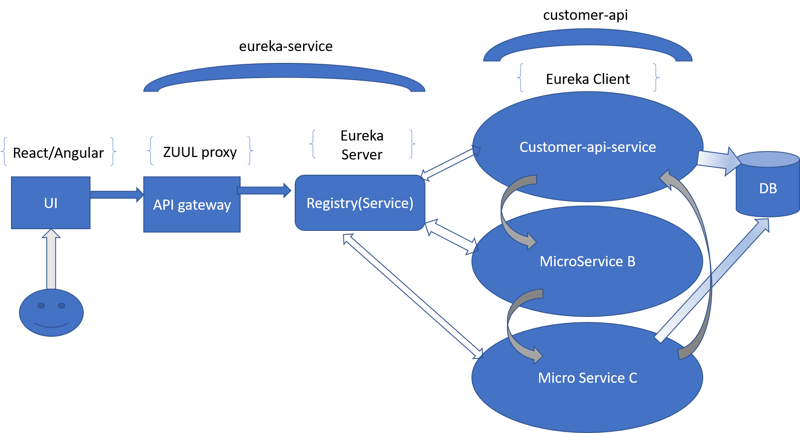

# Customer CRM Api
This is a simple light weight Spring Boot application in a Micro services ecosystem powered by Spring Cloud(Eureka and Zuul). Please not that since as per requirements, CRM is not yet ready for exposing REST APIS, I have taken the liberty to implement sample JPA repositories using the in-memory H2 database offered by Spring. 
I have also provided the interface for future CRM API consumption.
(note: Please refer to **Steps_to_run.pdf** for installation steps.)

Following are the components of the eco system, and it can be easily extended for further changes
  
  ## Swagger
  * Integrated Swagger in the project for API description and access. Refer to Steps_to_run.pdf to know how to access and use it.
  
  ## eureka-sevice
  * This is a lightweight service registry which makes use of Spring Cloud Eureka for registering clients. 
  **I have also merged an API gateway into this project which makes use of ZUUL proxy. Ideally this should have been a different project, but in the interest of time, I have merged it here.**
  * This project will act as a Eureka Server via the Spring wrapper for Netflix Eureka
  
  ## customer-api
  * This is a simple Spring boot application that does basic Customer CRUD using Spring MVC and JPA repository, and can be extended for consuming CRM data as it is not yet ready for exposing REST yet.
  * This project will act as a Eureka Client via the Spring wrapper for Netflix Eureka.
  * It will register itself on startup to Eureka and the configuration is specified in the application.yaml.
  * It also contains unit test cases for GET, POST and PUT using MockMVC.
  
  ## Assumptions
  ## Oauth2.0 security
  * I was not able to include my implementation of Oauth 2.0 security as there were some issues 
  which I can resolve given another day(or half day). So I completely removed the security module.
  * The way I implemented it is as follows,
    * In the customer-api, I added a ResourceServer and Authorization server.
      * The Resource server config is annotated with @EnableResourceServer, extends WebSecurityConfigurerAdapter and overrides configure method and uses Spring AuthenticationManager
      * The Authorization server config is annotated with @EnableAuthorizationServer, extends AuthorizationServerConfigurerAdapter  and overrides configure.
      * **I used the inMemory authentication of Spring. However, it can be extended to get from Database as well.**
    * In the eureka-service(api gateway), I added Oauth Config annotated with @EnableOAuth2Sso, extends WebSecurityConfigurerAdapter and permit all other urls except login. Also added a WebMvc config to redirect root to index using thymeleaf. The issue I faced is that for some reason I was getting a weird connection refused issue and I am trying to resolve it.
      
  ## Integration Design

  
